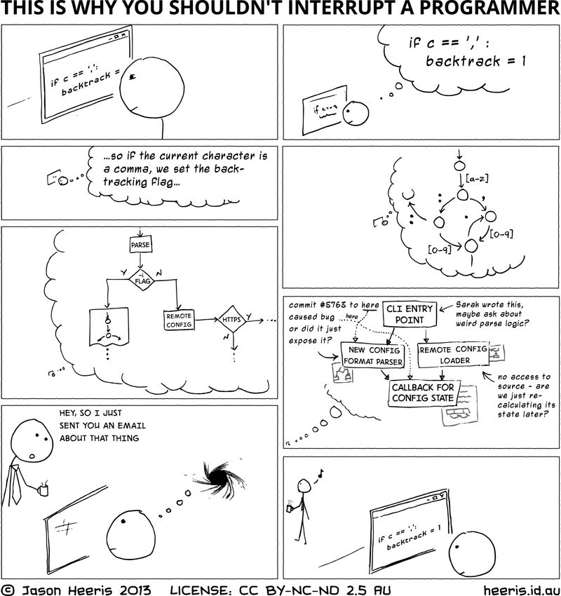

Desde que eu comecei a trabalhar em TI, sempre foi em espaços
open-office, daqueles que fica todo mundo em só uma sala, tanto
quando eu tava trabalhando em laboratórios na UFMA quanto fora
da UFMA, e eu nunca gostei muito deles, por que nunca consegui me concentrar
muito bem com gente do meu lado, ou atrás de mim, e com conversa.

Não por que eu não gostasse de gente falando, mas por que eu gosto
muito de interagir e conversar, e me distraio fácil, então é meio difícil
eu ter um momento prolongado de concentração nesse tipo de ambiente. Nos
laboratórios até dava, por que tem uma hierarquia mais rígida, tipo o
orientador sempre tava na sala, com alunos de mestrado e doutorado.

E, querendo ou não, computação, em qualquer área, é um trabalho cerebral,
que requer concentração, e qualquer interrupção leva as vezes a uma perda
de 20 minutos de pensamento, não é a toa que existe o esteriotipo
do programador em uma sala sozinho, dizendo pra passar a pizza por debaixo
da porta, por que as vezes isso é realmente necessário, então em computação,
em especial, acho que open office é um conceito horrível.

E, sobre o por que a outra parte desse post é "depressão", é por que
eu vejo uma boa parte das pessoas de computação com sintomas de depressão,
e uma das causas disso, eu acho, é por que as pessoas dessa área, pelo
menos as que eu conheço, tem uma paixão por ela, e tem projetos pessoais,
tanto freelance, que da dinheiro, quanto open source, que não dá dinheiro
algum, mas é algo em que ela se interessa.

E o que acontece quando se tem um ambiente open office, com constate
interrupção, é que as vezes, pra não dizer boa parte do tempo, não
se completa tudo o que tem que se fazer no trabalho, no trabalho, e
uma parte do trabalho, vai pra casa, o que acaba gerando um sentimento
de inutilidade, tipo "sou ruim, por que não consigo fazer todas as minhas
tarefas no trabalho, e tenho que terminar elas em casa.".

Alem desse sentimento de inutilidade, é somado o fato de que fazer
coisas do trabalho em casa tira tempo de atividades mais prazerosas,
mesmo que essas atividades prazerosas seja relacionadas a computação,
por que, afinal, somos todos nerds aqui.

Resumindo, acho que open office é ruim, por que impede as pessoas de se
concentrarem, o que é muito importante em computação, o que acaba
levando a um sentimento de inutilidade, por que o certo é fazer
as coisas do trabalho fora de casa, e deixar lá.
